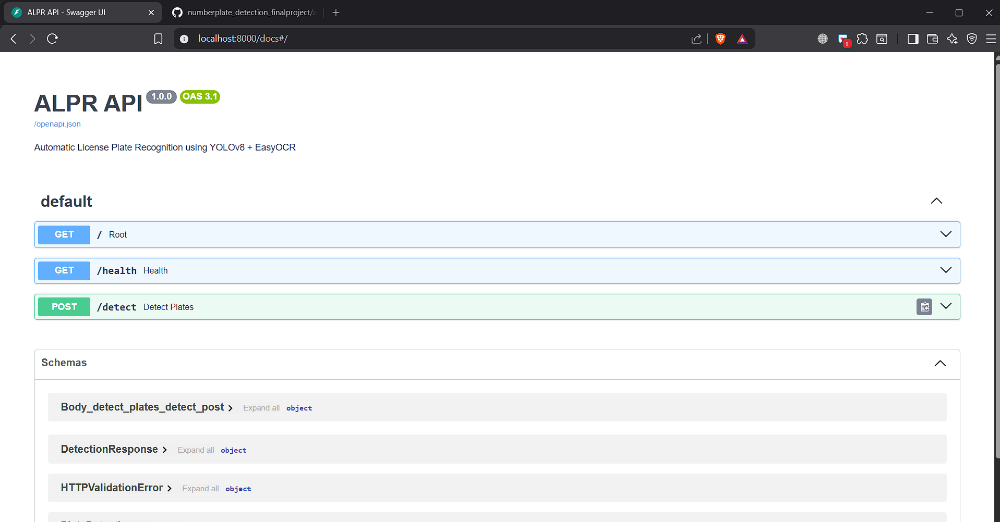
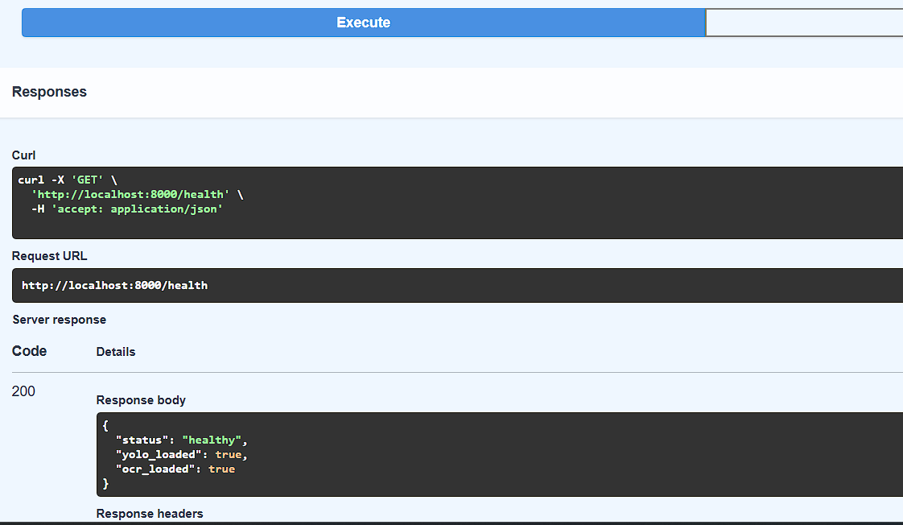

# 🚗 Automatic License Plate Recognition (ALPR)

> End-to-end ALPR system using YOLOv8 for plate detection and EasyOCR for text extraction — deployed as a real-time Streamlit web application.

## 📌 Overview

This project implements a production-ready Automatic License Plate Recognition system combining deep learning object detection with OCR. It detects vehicle number plates from images or live camera input and extracts alphanumeric text, enabling scalable vehicle identification for real-world applications.

## 🎯 Use Cases

- Traffic monitoring and enforcement
- Parking management systems
- Toll collection automation
- Security and surveillance

## 🛠️ Tech Stack

| Tool | Purpose |
|------|---------|
| YOLOv8 | Real-time number plate detection |
| EasyOCR | Deep learning-based text extraction |
| OpenCV | Image preprocessing |
| Streamlit | Web application deployment |
| Python | End-to-end pipeline |

## 🔍 Pipeline

### 1. Data Preparation
- Images and annotations validated for one-to-one mapping
- Dataset split: 80% train / 10% validation / 10% test
- Bounding box statistics analyzed for object scale and positioning

### 2. Model Training (YOLOv8)
- Pretrained YOLOv8 fine-tuned on custom annotated dataset (YOLO format)
- Single-class detection (`plate`) for improved localization accuracy
- GPU-accelerated training with loss monitoring to prevent overfitting

### 3. Model Evaluation
| Metric | Description |
|--------|-------------|
| Precision & Recall | Detection accuracy |
| F1-Score | Harmonic mean of precision/recall |
| mAP@50 | Mean average precision at IoU 0.50 |
| mAP@50–95 | Precision across IoU thresholds |

### 4. Image Preprocessing (OpenCV)
Detected plate regions enhanced before OCR:
- Grayscale conversion
- Image upscaling
- Adaptive / Otsu thresholding

### 5. OCR (EasyOCR)
- Handles skewed, low-resolution, and real-world plate images
- OCR confidence combined with detection score for reliable output

### 6. Streamlit Deployment
- Image upload and live camera input
- Real-time annotated detection display
- OCR text output
- Downloadable results (CSV + annotated images)
## REST API (FastAPI)

The model is also served as a REST API using FastAPI.

Start the API:
```bash
uvicorn api:app --reload
```
Interactive docs at `http://localhost:8000/docs`

### Endpoints
| Method | Endpoint | Description |
|--------|----------|-------------|
| GET | `/` | Health check |
| GET | `/health` | Model load status |
| POST | `/detect` | Detect plates in uploaded image |

### Screenshots






## ✅ Results

The system achieves high detection accuracy and real-time inference performance, demonstrating a robust ALPR pipeline suitable for region-specific and large-scale deployments with further dataset expansion.
